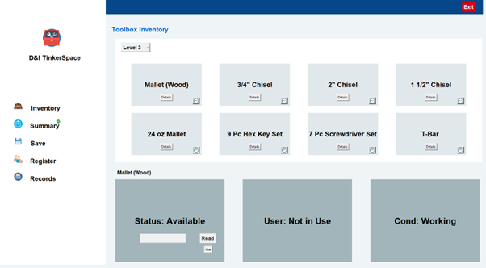
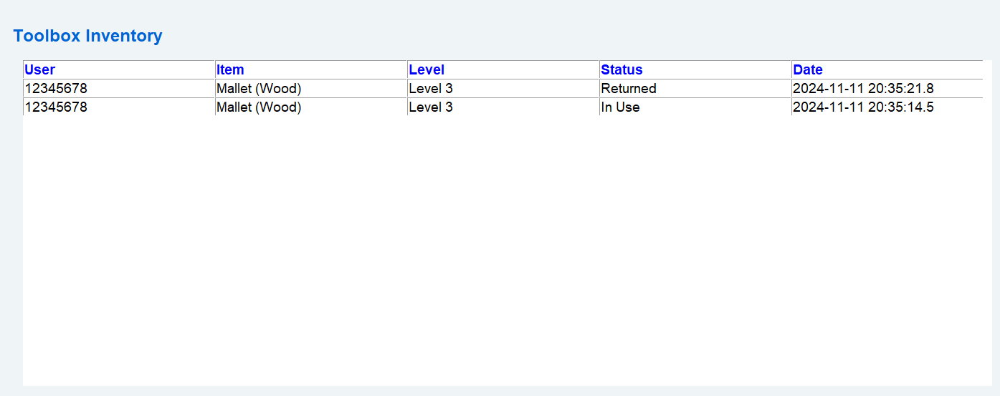

# Project Title

A simple python app to track inventory of items in a toolbox together with user details through facial recognition. 


## Deployment

To deploy this project run

1. Create a python virtual env
```bash
  py -m venv venv
```
2. Install packages from requirements.txt
```bash
  pip install -r requirements.txt
```
To note:
 - Ensure the following are installed properly: ```dlib``` and ```face_recognition```
 - Facial recongition only works on compatible realsense cameras
3. Run python app
```bash
  py .\run.py
```

## Authors

- [@arun-198](https://github.com/arun-198)
- [@m3-muru](https://github.com/m3-muru)


## Files

Inventory tab:
- run.py:
    - Contains the main tkinter classes to create GUI elements and run the application
- InventoryClass.py:
    - Contains the classes to initiate the toolbox, levels (trays) and the items in each level
- settings.py:
    - Contains the position, size and scaling factor for all the elements in the GUI
- Camera: 
    - The Details_Button class has "self.readBut" button to open the camera GUI and scan for the barcode


## Reference



